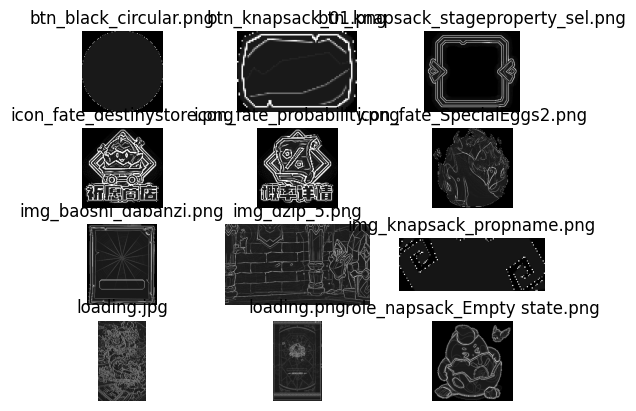
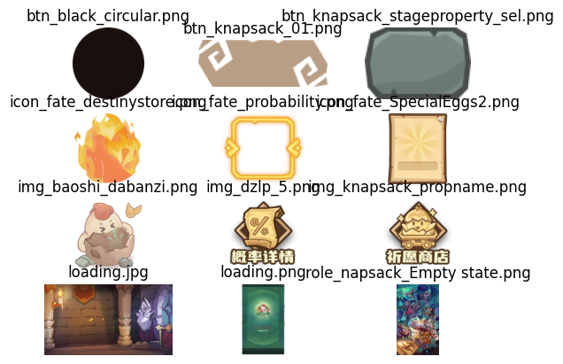

# Texture Processing

This is a tool to automatically specify a proper compression level for the given textures.

## Purpose

如果你像我一样也是个懒蛋，不想反复修改导入图片的compress level，那么可以交给脚本自动判断。贴图粗糙压缩损失率低，可以给一个高等级压缩；贴图精细压缩失真率高，则给一个低等级压缩

## Under the Hood

假设输入的图片都是线性空间的。

最简单的方法，直接在线性空间下计算压缩后的矩阵差，取Frobenius范数

这里的方法相对合理但比较主观，计算的是“视觉”空间下的损失函数。执行以下步骤：

1. gamma correction
2. 取a通道，计算卷积（laplacian算子）
3. 取rgb通道，灰值后，计算卷积（laplacian算子）
4. 取2和3的最大值与a通道加权，输出矩阵记为M
4. 模拟压缩，与原图相减，与M加权求和

对于亮度，人眼的感受需要在gamma空间下计算。

另，此计算方法基于假设：

* 对于一张图片，人眼总是更多关注细节多、对比度强的位置。因此2、3计算卷积作为权重
* 图片不经过缩放显示在游戏内

“视觉”兴趣区域结果：

细节度排序结果：

## Work Flow

to 加速，你需要joblib并行处理输入，可以把结果送到打包机redis上，通过c#获取结果，自行离散化输出，并于compress level一一对应（目前我是这样实现的）
